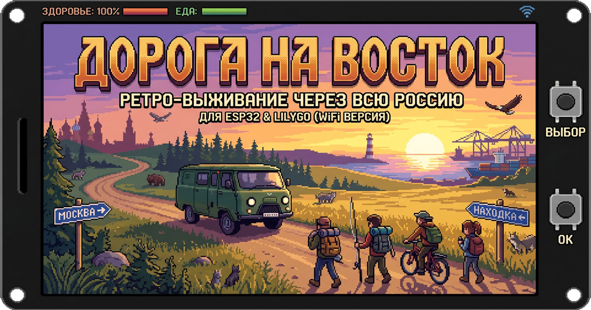
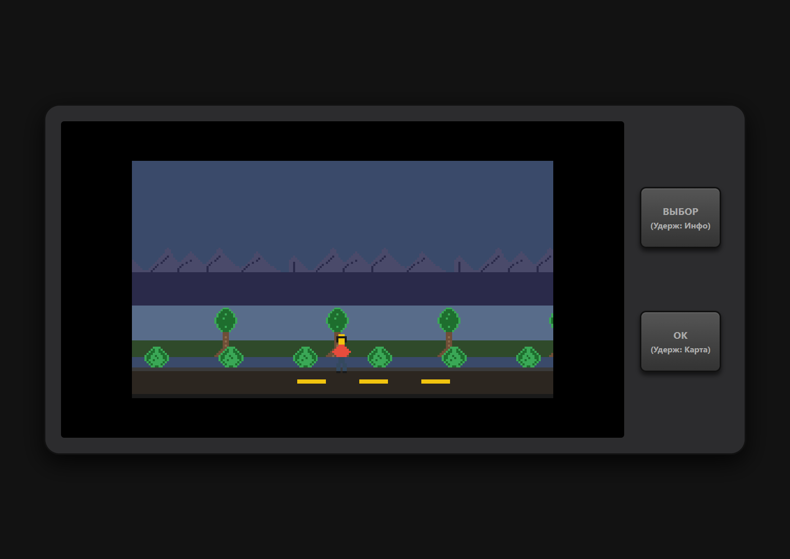

# Дорога на восток

Текстовая survival-игра о путешествии через всю Россию. Текущий репозиторий содержит браузерный прототип, который одновременно служит игровым демо и техническим макетом для будущего аппаратного клиента на ESP32 LilyGO T-Display.

Онлайн-демо: https://gritsenko.biz/buhanka/

## Что это за проект

Игрок ведет небольшую группу на восток, выбирает действия в событиях, следит за едой, здоровьем, моралью и транспортом. Прототип сделан как PWA, но архитектура уже подчинена ограничениям будущего железа: небольшой экран, две физические кнопки, ограниченная память и необходимость хранить контент в компактном формате.

## Идея архитектуры

Проект построен по data-driven схеме: контент отделен от игрового рантайма, а визуальная часть описывается декларативно.

- `data/events.json` хранит игровые события, тексты, подсказки, эффекты выбора и переходы между сценами.
- `data/scenes.json` описывает сцены как наборы слоев, которые можно одинаково интерпретировать и в браузере, и на микроконтроллере.
- `data/sprites.json` задает манифест спрайтов и анимаций.
- `js/app.js` содержит игровой цикл, состояние партии, обработку выбора, рендер UI и проигрывание переходных сцен.
- `assets/sprites/` хранит исходные пиксель-арт спрайты для веб-версии и будущего конвертера ассетов.

Практически это означает следующее:

1. Браузерная версия выступает референсной реализацией логики.
2. Контент можно обновлять отдельно от движка, не переписывая код.
3. Аппаратный клиент сможет использовать ту же модель данных, заменив только слой загрузки, рендера и ввода.

## Как сейчас устроен прототип

- Интерфейс имитирует экран LilyGO T-Display и две аппаратные кнопки.
- Основной UI работает как текстовое приключение с выбором действий.
- Между событиями проигрываются короткие пиксель-арт сцены на canvas с внутренним разрешением `204x115`.
- Управление продублировано для тач-экрана, чтобы игру можно было запускать как обычную веб-страницу или PWA.

## План по аппаратному клиенту

Ниже не абстрактные идеи, а рабочий план переноса браузерного прототипа на ESP32.

### 1. Зафиксировать формат контента

- Сохранить текущую JSON-схему событий и сцен как основной контракт между редактором контента и клиентами.
- При необходимости добавить версионирование пакета данных, чтобы прошивка понимала совместимость контента.
- Описать обязательные и опциональные поля для событий, выборов, сцен и спрайтов.

### 2. Собрать офлайн-пайплайн ассетов

- Конвертировать PNG-спрайты в формат, подходящий для ESP32: `RGB565`, indexed palette или `RLE`-сжатие.
- Генерировать C/C++-массивы для прошивки или компактный бинарный пакет для SPIFFS/LittleFS.
- Поддержать тот же манифест имен спрайтов, который уже используется в веб-прототипе.

### 3. Разделить прошивку на независимые подсистемы

- `ContentLoader`: загрузка локального или сетевого контента, кэширование, проверка версии.
- `GameState`: текущее состояние партии, ресурсов, транспорта и переходов по событиям.
- `SceneRenderer`: отрисовка прямоугольников, тайловых фонов и спрайтов на дисплей.
- `InputController`: короткие и длинные нажатия двух кнопок, debounce, повтор ввода.
- `UiScreens`: экран события, карта, статус, переходная анимация, game over и финал демо.

### 4. Реализовать минимальный автономный клиент

- Первый этап: вся история и ассеты зашиты в прошивку, без сети.
- Второй этап: клиент умеет подтягивать JSON по Wi‑Fi и обновлять контент без перепрошивки.
- Третий этап: добавить сохранение прогресса во flash-память и восстановление сессии после перезапуска.

### 5. Учесть ограничения железа заранее

- Не держать в памяти все декодированные изображения одновременно.
- Загружать только нужные сцены и кадры, а тяжелые ассеты держать в flash/PSRAM.
- Избегать сложной композиции UI: приоритет у читаемого текста, крупных индикаторов и быстрых переходов.
- Оставить логику сцены максимально детерминированной, чтобы рендер был дешевым по CPU.

## Почему такой подход разумен

Вместо отдельной «временной» веб-версии и отдельной прошивки проект уже сейчас использует общий контракт данных и общую модель сцен. Это снижает риск расхождения между прототипом и железом: браузерная версия служит одновременно игровым демо, тестовым стендом для баланса и спецификацией будущего embedded-клиента.

## Структура репозитория

- `index.html` — оболочка приложения и мета-информация страницы.
- `css/style.css` — стили интерфейса и экранного макета.
- `js/app.js` — игровая логика, UI, анимация и обработка ввода.
- `data/` — события, сцены и описание спрайтов.
- `assets/sprites/` — исходные пиксель-арт ассеты.
- `scripts/` — вспомогательные скрипты для ассетов и подготовки ресурсов.
- `firmware/` — PlatformIO-проект с прошивками для аппаратных клиентов
  (на старте — LilyGO TTGO T-Display v1.1, структура рассчитана на добавление
  других устройств). Подробности — в [firmware/README.md](./firmware/README.md).

## Дальше

Ближайший логичный шаг — формально описать JSON-схему контента и рядом сделать конвертер ассетов для ESP32, чтобы веб-демо и аппаратный клиент гарантированно использовали один и тот же набор данных.